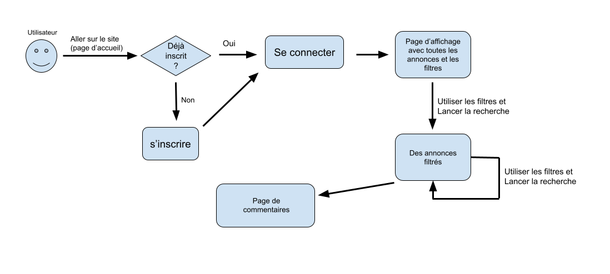

# Internshiplz
Project of M1S2, a website where you can find information of internships (or jobs maybe) of nlp/TAL

[la page de notre site](http://i3l.univ-grenoble-alpes.fr/~tangyuhe/)

#### compte et mots de passe:

    username    mots de passe
    schnappi    schnappi
    Mibo        Mibo
    Yuhe        Yuhe
    yuhe        yuhe
*ou vous pouvez aussi créer votre propre compte*

#### cahier des charges:

#### structure de fichiers:

    /actions (contient les fichiers de script pour traiter base de données de php pure (sauf login.php))
        login.php       # base de données pour utilisateurs et affichage de la formulaire d'inscritption
        inscrit.php     # base de données pour utilisateurs
        etatSite.php    # affiche nombre de comptes et de commentaires.

        nbWebscrap.php  # affiche nombre de résultat de webscraping
        rechercher.php  # base de données pour les stages
        action.php      # script php pour rechercher dans bdd des stages

        discuter.php    # base de données pour les messages
        EnvoyerComm.php # script php pour afficher un nouveau message

    /backend
        pyWebscrap.py  # script python pour le webscraping
    /templates (contient les fichiers qui rendre la page par différents parties)
        acceuil.php         # page template avant la connection
        acc_connected.php   # page template après la connection
        recherche.php       # page qui affiche les info et les stages
        discussion.php      # page de forum
    /text_files
        (les fichiers .txt qui sauvegardent les informations de stage pour traiter et télécharger)
    /fichier_html
        (les fichiers .html qui sauvegardent les informations de stage pour afficher sur la page recherche)

    connected.php   # gérer les templates après la connection, et aussi lancement de script python
    main_posi.css   # positions des éléments css
    main_style.css  # styles des éléments css
    index.php       # page avant la connection
    script.js       # js pour les boutons etc. avec fonction ajax
    FichierHtml_style.css   #styles des éléments css pour les fichiers .html
